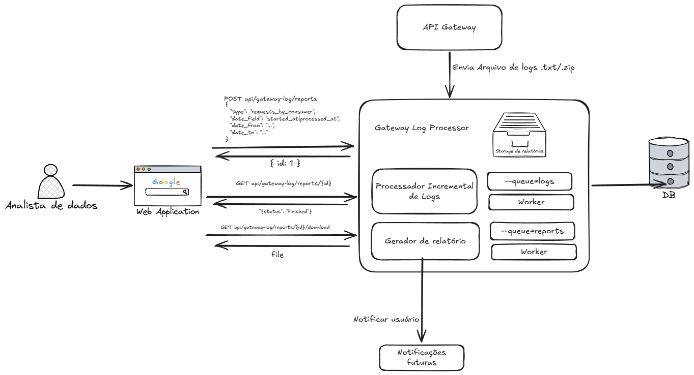
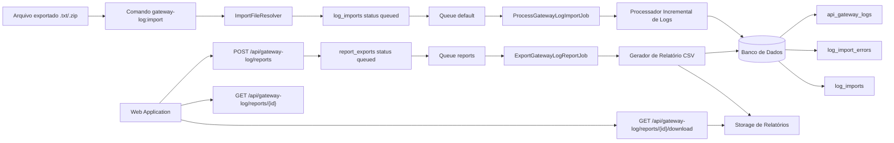
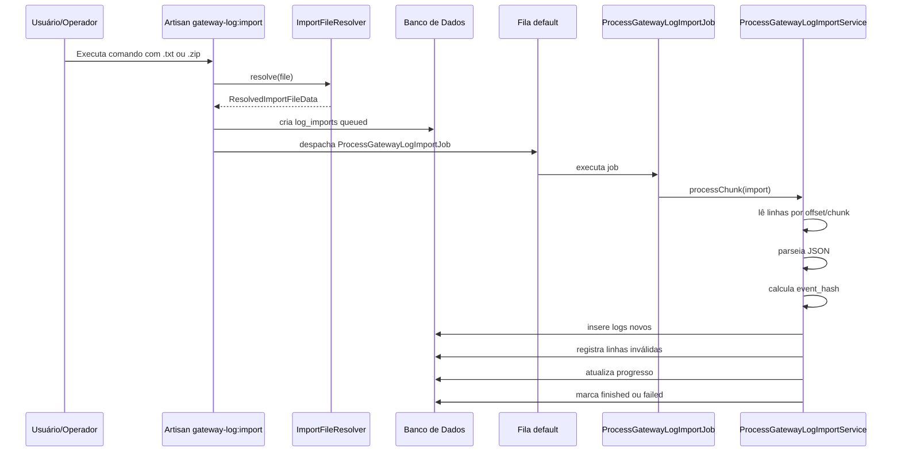
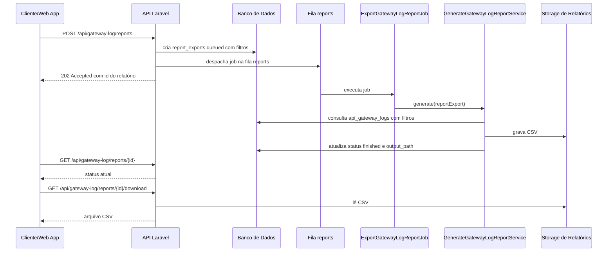
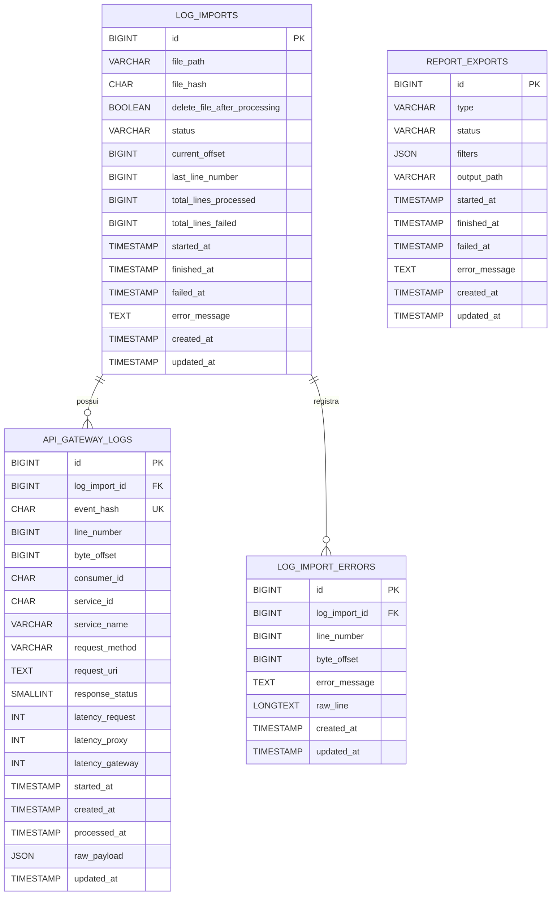

# Gateway Log Processor

## 1. Visão geral

O **Gateway Log Processor** é uma aplicação desenvolvida em **Laravel 13** para processar arquivos de logs de um API Gateway, persistir requisições em banco de dados de forma deduplicada e gerar relatórios CSV assíncronos com métricas de volume e latência.

A solução foi pensada para um cenário em que os logs são exportados periodicamente em arquivos `.txt` ou `.zip`, contendo um histórico temporal de requisições. O sistema permite importar esses arquivos, processá-los em background, evitar duplicidade de eventos e disponibilizar relatórios sob demanda por API ou comando Artisan.

Os principais objetivos da solução são:

* importar arquivos grandes de logs sem carregar todo o conteúdo em memória;
* processar logs de forma incremental e assíncrona;
* evitar duplicidade de arquivos e de requisições;
* registrar falhas de linhas inválidas sem interromper toda a importação;
* gerar relatórios CSV assíncronos;
* permitir filtros por momento original da requisição e momento de ingestão;
* expor endpoints para solicitar, consultar e baixar relatórios;
* manter uma arquitetura organizada, testável e extensível.

---

## 2. Tecnologias utilizadas

A aplicação foi construída com as seguintes tecnologias:

| Tecnologia              | Uso                                                          |
| ----------------------- | ------------------------------------------------------------ |
| Laravel 13              | Framework principal da aplicação                             |
| PHP 8+                  | Linguagem da aplicação                                       |
| Eloquent ORM            | Modelagem das entidades principais                           |
| Query Builder           | Consultas agregadas e inserts em lote com melhor performance |
| Laravel Queues          | Processamento assíncrono de importações e relatórios         |
| Artisan Commands        | Execução de importação e geração de relatórios via terminal  |
| PHPUnit                 | Testes automatizados                                         |
| GitHub Actions          | Execução da suíte de testes em CI                            |
| Docker / Docker Compose | Ambiente de execução e desenvolvimento                       |
| CSV                     | Formato de saída dos relatórios                              |
| ZipArchive              | Leitura e extração de arquivos `.zip`                        |

---

## 3. Funcionalidades implementadas

### 3.1 Importação de logs

O sistema permite importar arquivos `.txt` ou `.zip`.

O comando principal é:

```bash
php artisan gateway-log:import storage/app/logs/logs.txt
```

Também é possível importar um arquivo `.zip`:

```bash
php artisan gateway-log:import storage/app/logs/logs.zip
```

E também caminhos absolutos, desde que o caminho exista no ambiente onde o Laravel está rodando:

```bash
php artisan gateway-log:import /var/www/html/storage/app/logs/logs.txt
```

Ao importar um `.zip`, o sistema procura um arquivo `.txt` dentro do pacote. A regra adotada foi:

1. se existir `logs.txt`, ele será usado;
2. se não existir `logs.txt`, mas existir exatamente um `.txt`, esse arquivo será usado;
3. se não existir `.txt`, a importação falha;
4. se existirem múltiplos `.txt` e nenhum `logs.txt`, a importação falha por ambiguidade.

O arquivo extraído do `.zip` é temporário e removido ao final do processamento.

---

### 3.2 Processamento assíncrono em chunks

A importação não processa o arquivo diretamente no comando Artisan. O comando apenas cria o registro da importação e despacha um job para a fila.

Fluxo simplificado:

```text
gateway-log:import
    ↓
resolve arquivo .txt/.zip
    ↓
cria log_imports com status queued
    ↓
despacha ProcessGatewayLogImportJob
    ↓
worker processa em chunks
    ↓
salva logs válidos e erros de linha
```

O processamento em chunks evita carregar arquivos grandes em memória. Cada job processa apenas uma parte do arquivo e, caso ainda existam linhas restantes, despacha outro job para continuar a partir do último offset salvo.

Campos usados para continuidade:

* `current_offset`
* `last_line_number`
* `total_lines_processed`
* `total_lines_failed`

---

### 3.3 Idempotência por arquivo

Para evitar reprocessamento do mesmo arquivo exato, o sistema calcula um `file_hash` SHA-256 do arquivo `.txt` final.

Mesmo que o arquivo venha compactado em `.zip`, o hash é calculado sobre o conteúdo extraído do `.txt`, não sobre o `.zip`.

Isso permite que:

```text
logs.txt
```

e:

```text
logs.zip contendo logs.txt com mesmo conteúdo
```

sejam tratados como o mesmo arquivo lógico.

Se o mesmo arquivo for enviado novamente, o sistema não cria uma nova importação nem despacha um novo job. Em vez disso, informa que a importação já existe.

---

### 3.4 Deduplicação por evento

Além da idempotência por arquivo, o sistema evita duplicidade de requisições usando um `event_hash`.

Essa decisão foi tomada porque arquivos acumulativos podem conter eventos já importados anteriormente.

Exemplo:

```text
Arquivo 1:
A, B, C

Arquivo 2:
A, B, C, D, E
```

Sem deduplicação, os eventos `A`, `B` e `C` seriam salvos duas vezes. Com `event_hash`, o banco mantém apenas:

```text
A, B, C, D, E
```

O `event_hash` é calculado a partir dos campos relevantes do log, como:

* `started_at`
* `consumer_id`
* `service_id`
* `service_name`
* `request_method`
* `request_uri`
* `response_status`
* `latency_request`
* `latency_proxy`
* `latency_gateway`
* `client_ip`, quando disponível

Essa abordagem é mais robusta do que gerar hash da linha bruta, pois não depende da ordem dos campos no JSON.

A coluna `event_hash` possui índice único no banco, garantindo consistência mesmo em cenários concorrentes.

---

### 3.5 Registro de erros de linha

Uma linha inválida não interrompe toda a importação.

Quando uma linha não pode ser interpretada, o erro é registrado em `log_import_errors`, contendo:

* importação relacionada;
* número da linha;
* offset;
* mensagem de erro;
* conteúdo bruto da linha.

Isso permite auditoria posterior sem comprometer o processamento das demais linhas válidas.

---

### 3.6 Geração assíncrona de relatórios CSV

Os relatórios são gerados de forma assíncrona na fila `reports`.

A solicitação de relatório cria um registro em `report_exports` com status `queued` e despacha um job para a fila.

Fluxo:

```text
POST /api/gateway-log/reports
    ↓
cria report_exports com status queued
    ↓
despacha ExportGatewayLogReportJob na fila reports
    ↓
worker gera CSV
    ↓
atualiza report_exports para finished ou failed
```

Os relatórios implementados são:

| Tipo                         | Descrição                           |
| ---------------------------- | ----------------------------------- |
| `requests_by_consumer`       | Total de requisições por consumidor |
| `requests_by_service`        | Total de requisições por serviço    |
| `average_latency_by_service` | Média de latência por serviço       |

---

### 3.7 Filtros por data

Os relatórios aceitam filtros opcionais por período.

Existem dois campos possíveis para filtragem:

| Campo          | Significado                                               |
| -------------- | --------------------------------------------------------- |
| `started_at`   | momento original da requisição no API Gateway             |
| `processed_at` | momento em que o log foi ingerido/processado pelo sistema |

Exemplo filtrando pelo momento original da requisição:

```json
{
  "type": "requests_by_consumer",
  "date_field": "started_at",
  "date_from": "2026-05-01T00:00:00Z",
  "date_to": "2026-05-31T23:59:59Z"
}
```

Exemplo filtrando pelo momento de ingestão:

```json
{
  "type": "requests_by_consumer",
  "date_field": "processed_at",
  "date_from": "2026-05-01T00:00:00Z",
  "date_to": "2026-05-31T23:59:59Z"
}
```

Quando `date_from` ou `date_to` são informados sem `date_field`, o sistema usa `started_at` como padrão.

Os filtros são persistidos em `report_exports.filters`, garantindo que o job assíncrono use os mesmos parâmetros informados no momento da solicitação.

---

## 4. Arquitetura da solução

### 4.1 Visão geral

Versão macro:


Versão micro:



---

### 4.2 Fluxo de importação



---

### 4.3 Fluxo de geração de relatório



---

## 5. Modelagem de dados



---

## 6. Organização do projeto

A solução foi organizada com uma separação inspirada em Clean Architecture, evitando concentrar regras de negócio em controllers, models ou commands.

Estrutura principal:

```text
app/
├── Application/
│   └── GatewayLog/
│       ├── Reports/
│       │   ├── Contracts/
│       │   ├── Generators/
│       │   └── Support/
│       └── Services/
├── Domain/
│   └── GatewayLog/
│       ├── DTO/
│       ├── Enums/
│       └── Exceptions/
├── Http/
│   ├── Controllers/
│   ├── Requests/
│   └── Resources/
├── Jobs/
└── Models/
```

### Camada Domain

Contém objetos de domínio simples e independentes de infraestrutura:

* DTOs;
* enums;
* exceptions.

Exemplos:

* `GatewayLogData`
* `LatencyData`
* `ImportProgressData`
* `ReportFiltersData`
* `LogImportStatus`
* `ReportExportStatus`
* `ReportType`
* `ReportDateField`

### Camada Application

Contém os serviços de aplicação e regras de orquestração.

Exemplos:

* `ImportFileResolver`
* `NdjsonLogFileReader`
* `GatewayLogParser`
* `GatewayLogEventHashGenerator`
* `ProcessGatewayLogImportService`
* `CreateGatewayLogReportExportService`
* `QueueGatewayLogReportExportService`
* `GenerateGatewayLogReportService`
* `CsvReportWriter`

### Camada HTTP

Contém controllers, requests e resources.

Exemplos:

* `GatewayLogReportController`
* `StoreGatewayLogReportRequest`
* `ReportExportResource`

### Jobs

Contém jobs assíncronos:

* `ProcessGatewayLogImportJob`
* `ExportGatewayLogReportJob`

---

## 7. Padrões e conceitos utilizados

### 7.1 DTO

DTOs foram usados para transportar dados entre camadas sem depender diretamente de arrays soltos.

Exemplos:

* `GatewayLogData`
* `LatencyData`
* `ReportFiltersData`
* `ResolvedImportFileData`

Isso melhora legibilidade, tipagem e testabilidade.

---

### 7.2 Factory

A geração dos relatórios usa uma factory:

```php
GatewayLogReportFactory
```

Ela centraliza a escolha do gerador correto com base no `ReportType`.

Tipos suportados:

* `RequestsByConsumerReportGenerator`
* `RequestsByServiceReportGenerator`
* `AverageLatencyByServiceReportGenerator`

---

### 7.3 Strategy

Cada relatório possui sua própria classe geradora, seguindo a ideia de Strategy.

Cada estratégia implementa a mesma interface:

```php
GatewayLogReportGenerator
```

Isso permite adicionar novos relatórios no futuro sem modificar o fluxo principal de geração.

---

### 7.4 Service Layer

Regras de aplicação foram isoladas em services, evitando controllers e commands muito grandes.

Exemplos:

* `ProcessGatewayLogImportService`
* `GenerateGatewayLogReportService`
* `QueueGatewayLogReportExportService`

---

### 7.5 Jobs e filas

A importação e a geração de relatórios são assíncronas.

Isso evita:

* requisições HTTP longas;
* comandos Artisan bloqueados por processamento pesado;
* uso excessivo de memória;
* timeout em arquivos grandes.

---

### 7.6 Idempotência

A solução usa dois níveis de idempotência:

```text
file_hash  → evita reprocessar o mesmo arquivo
event_hash → evita duplicar a mesma requisição
```

Essa decisão foi importante porque os arquivos podem ser históricos e acumulativos.

---

### 7.7 Processamento incremental

O arquivo é lido em partes, usando offset e número da linha.

Isso permite:

* processar arquivos grandes;
* retomar a partir do progresso salvo;
* reduzir uso de memória;
* evitar leitura completa do arquivo.

---

## 8. Endpoints da API

### 8.1 Solicitar relatório

```http
POST /api/gateway-log/reports
```

Payload mínimo:

```json
{
  "type": "requests_by_consumer"
}
```

Payload com filtros:

```json
{
  "type": "requests_by_consumer",
  "date_field": "started_at",
  "date_from": "2026-05-01T00:00:00Z",
  "date_to": "2026-05-31T23:59:59Z"
}
```

Resposta:

```json
{
  "data": {
    "id": 1,
    "type": "requests_by_consumer",
    "status": "queued",
    "filters": {
      "date_field": "started_at",
      "date_from": "2026-05-01T00:00:00.000000Z",
      "date_to": "2026-05-31T23:59:59.000000Z"
    },
    "output_path": null,
    "started_at": null,
    "finished_at": null,
    "failed_at": null,
    "error_message": null
  }
}
```

Status HTTP:

```text
202 Accepted
```

---

### 8.2 Consultar status do relatório

```http
GET /api/gateway-log/reports/{id}
```

Resposta:

```json
{
  "data": {
    "id": 1,
    "type": "requests_by_consumer",
    "status": "finished",
    "filters": {
      "date_field": "started_at",
      "date_from": "2026-05-01T00:00:00.000000Z",
      "date_to": "2026-05-31T23:59:59.000000Z"
    },
    "output_path": "/var/www/html/storage/app/reports/1_requests_by_consumer.csv",
    "started_at": "2026-05-29T10:00:00.000000Z",
    "finished_at": "2026-05-29T10:00:01.000000Z",
    "failed_at": null,
    "error_message": null
  }
}
```

---

### 8.3 Baixar CSV

```http
GET /api/gateway-log/reports/{id}/download
```

Regras:

* se o relatório não estiver `finished`, retorna erro 422;
* se o arquivo não existir, retorna erro 404;
* se estiver disponível, retorna o CSV para download.

---

## 9. Comandos Artisan

### 9.1 Importar logs

O comando de importação aceita arquivos `.txt` e `.zip`.

```bash
php artisan gateway-log:import storage/app/logs/logs.txt
```

Com tamanho de chunk customizado:

```bash
php artisan gateway-log:import storage/app/logs/logs.txt --chunk=1000
```

Importar arquivo `.zip`:

```bash
php artisan gateway-log:import storage/app/logs/logs.zip
```

Também é possível informar um caminho absoluto, desde que o arquivo exista no ambiente onde o Laravel está sendo executado:

```bash
php artisan gateway-log:import /var/www/html/storage/app/logs/logs.txt
```

> Importante: ao executar comandos com `docker compose exec app`, o Laravel está rodando dentro do container. Portanto, caminhos absolutos do Windows, como `D:\download\logs.txt`, não existem dentro do container. Nesse caso, copie o arquivo para dentro do container ou use um volume montado.

Exemplo copiando um arquivo do Windows para o container:

```powershell
docker compose cp "D:\download\logs.txt" app:/var/www/html/storage/app/logs/logs.txt
```

Depois execute:

```bash
docker compose exec app php artisan gateway-log:import storage/app/logs/logs.txt
```

Exemplo de saída para importação de `.zip`:

```text
Input file: storage/app/logs/logs.zip
Resolved log file: /var/www/html/storage/app/imports/extracted/abc123/logs.txt
File type: zip
File hash: abc123...
Extracted from: /var/www/html/storage/app/logs/logs.zip
Gateway log import [1] queued successfully.
Queue: default
Chunk size: 1000
```

Quando um `.zip` é importado, o sistema extrai temporariamente o `.txt`, processa o arquivo em fila e remove o arquivo extraído ao final do processamento.

---

### 9.2 Gerar relatórios

Relatório de requisições por consumidor:

```bash
php artisan gateway-log:report requests_by_consumer
```

Relatório de requisições por serviço:

```bash
php artisan gateway-log:report requests_by_service
```

Relatório de latência média por serviço:

```bash
php artisan gateway-log:report average_latency_by_service
```

Com filtro por momento original da requisição:

```bash
php artisan gateway-log:report requests_by_consumer \
  --date-field=started_at \
  --from="2026-05-01T00:00:00Z" \
  --to="2026-05-31T23:59:59Z"
```

Com filtro por momento de ingestão:

```bash
php artisan gateway-log:report requests_by_consumer \
  --date-field=processed_at \
  --from="2026-05-01T00:00:00Z" \
  --to="2026-05-31T23:59:59Z"
```

Com diretório de saída customizado:

```bash
php artisan gateway-log:report requests_by_consumer --output=storage/app/reports
```

No Windows PowerShell, os filtros podem ser passados em uma única linha:

```powershell
docker compose exec app php artisan gateway-log:report requests_by_consumer --date-field=started_at --from="2026-05-01T00:00:00Z" --to="2026-05-31T23:59:59Z"
```

---

## 10. Instalação e execução

### 10.1 Requisitos

Para executar o projeto localmente, é necessário ter instalado:

* Docker;
* Docker Compose;
* Git.

A aplicação foi preparada para rodar em containers. O container da aplicação executa automaticamente algumas tarefas de inicialização por meio do `entrypoint.sh`, como:

```text
composer install --no-interaction
aguardar conexão com o banco de dados
php artisan migrate --force
iniciar o PHP-FPM
```

Portanto, ao executar o projeto com Docker, não é obrigatório rodar manualmente `composer install` nem `php artisan migrate` como passos principais de instalação.

---

### 10.2 Clonar o projeto

```bash
git clone https://github.com/caiquedebrito/gateway-log-processor
cd gateway-log-processor
```

---

### 10.3 Configurar ambiente

Copie o arquivo de exemplo:

```bash
cp .env.example .env
```

No Windows PowerShell:

```powershell
Copy-Item .env.example .env
```

Confira se as variáveis do banco estão compatíveis com os serviços definidos no `docker-compose.yml`.

Exemplo:

```env
APP_NAME="Gateway Log Processor"
APP_ENV=local
APP_DEBUG=true
APP_URL=http://localhost:8080

DB_CONNECTION=mysql
DB_HOST=db
DB_PORT=3306
DB_DATABASE=gateway_logs
DB_USERNAME=gateway
DB_PASSWORD=gateway

QUEUE_CONNECTION=database
```

---

### 10.4 Subir ambiente Docker

```bash
docker compose up -d --build
```

Durante a inicialização, o container da aplicação instala as dependências, aguarda o banco ficar disponível e executa as migrations automaticamente.

---

### 10.5 Gerar chave da aplicação

Se a variável `APP_KEY` ainda não estiver preenchida no `.env`, execute:

```bash
docker compose exec app php artisan key:generate
```

Esse passo é necessário apenas uma vez.

---

### 10.6 Verificar se a aplicação está no ar

Acesse:

```text
http://localhost
```

O Nginx serve a aplicação a partir de:

```text
/var/www/html/public
```

e encaminha as requisições PHP para o serviço PHP-FPM da aplicação.

---

### 10.7 Workers das filas

A importação de logs e a geração de relatórios são assíncronas, mas não é necessário iniciar os workers manualmente em uma execução normal com Docker Compose.

O `docker-compose.yml` já define um serviço próprio para filas:

```yaml
queue:
  command: php artisan queue:work --queue=logs,reports --sleep=1 --tries=3
```

Esse container executa o worker automaticamente ao subir o ambiente com:

```bash
docker compose up -d --build
```

Portanto, o fluxo padrão é:

```text
app   → executa a aplicação Laravel/PHP-FPM
nginx → expõe a aplicação em http://localhost:8080
mysql → banco de dados MySQL
queue → processa os jobs das filas logs e reports
```

Para acompanhar os jobs em execução, use:

```bash
docker compose logs -f queue
```

Para reiniciar apenas o worker de filas:

```bash
docker compose restart queue
```

Para executar um worker manualmente, apenas em caso de debug, use:

```bash
docker compose exec app php artisan queue:work --queue=logs,reports --sleep=1 --tries=3
```

---

### 10.8 Fluxo básico de uso

Copie o arquivo de log para dentro do container:

```powershell
docker compose cp "D:\download\logs.txt" app:/var/www/html/storage/app/logs/logs.txt
```

Solicite a importação:

```bash
docker compose exec app php artisan gateway-log:import storage/app/logs/logs.txt
```

A importação será processada automaticamente pelo container `queue`, que escuta a fila `logs`.

Para acompanhar o processamento:

```bash
docker compose logs -f queue
```

Depois, solicite um relatório:

```bash
docker compose exec app php artisan gateway-log:report requests_by_consumer
```

A geração do CSV também será processada automaticamente pelo container `queue`, que escuta a fila `reports`.

Também é possível solicitar o relatório pela API:

```bash
curl -X POST http://localhost:8080/api/gateway-log/reports \
  -H "Content-Type: application/json" \
  -H "Accept: application/json" \
  -d '{"type":"requests_by_consumer"}'
```

---

### 10.9 Solicitar relatório pela API

```bash
curl -X POST http://localhost:8080/api/gateway-log/reports \
  -H "Content-Type: application/json" \
  -H "Accept: application/json" \
  -d '{"type":"requests_by_consumer"}'
```

Com filtros:

```bash
curl -X POST http://localhost:8080/api/gateway-log/reports \
  -H "Content-Type: application/json" \
  -H "Accept: application/json" \
  -d '{
    "type": "requests_by_consumer",
    "date_field": "started_at",
    "date_from": "2026-05-01T00:00:00Z",
    "date_to": "2026-05-31T23:59:59Z"
  }'
```

---

### 10.10 Consultar status do relatório

```bash
curl -X GET http://localhost:8080/api/gateway-log/reports/1 \
  -H "Accept: application/json"
```

---

### 10.11 Baixar CSV

```bash
curl -OJ http://localhost:8080/api/gateway-log/reports/1/download \
  -H "Accept: text/csv"
```

---

### 10.12 Comandos úteis

Reiniciar containers:

```bash
docker compose restart
```

Visualizar logs da aplicação:

```bash
docker compose logs -f app
```

Acessar shell do container:

```bash
docker compose exec app sh
```

Rodar migrations manualmente, se necessário:

```bash
docker compose exec app php artisan migrate
```

Recriar banco em ambiente local:

```bash
docker compose exec app php artisan migrate:fresh
```

Limpar caches do Laravel:

```bash
docker compose exec app php artisan optimize:clear
```

---

## 11. Execução dos testes

### 11.1 Rodar todos os testes

```bash
docker compose exec app php artisan test
```

---

### 11.2 Rodar testes específicos

Testes do resolvedor de arquivos `.txt` e `.zip`:

```bash
docker compose exec app php artisan test --filter=ImportFileResolverTest
```

Testes do serviço de importação:

```bash
docker compose exec app php artisan test --filter=ProcessGatewayLogImportServiceTest
```

Testes do comando de importação:

```bash
docker compose exec app php artisan test --filter=ImportGatewayLogsCommandTest
```

Testes do serviço de geração de relatórios:

```bash
docker compose exec app php artisan test --filter=GenerateGatewayLogReportServiceTest
```

Testes do job de relatório:

```bash
docker compose exec app php artisan test --filter=ExportGatewayLogReportJobTest
```

Testes da API de relatórios:

```bash
docker compose exec app php artisan test --filter=GatewayLogReportControllerTest
```

Testes dos filtros dos relatórios:

```bash
docker compose exec app php artisan test --filter=GatewayLogReportFiltersTest
```

---

### 11.3 Rodar Laravel Pint

Verificar estilo do código:

```bash
docker compose exec app ./vendor/bin/pint --test
```
ou
```bash
./vendor/bin/pint --test
```

Corrigir estilo automaticamente:

```bash
docker compose exec app ./vendor/bin/pint
```
ou
```bash
./vendor/bin/pint
```

---

### 11.4 Observação sobre a CI

A pipeline de CI também executa os testes e a verificação de estilo. Isso ajuda a validar que o comportamento da aplicação continua correto em um ambiente limpo, diferente do ambiente local.

## 12. Integração contínua com GitHub Actions

O projeto usa GitHub Actions para executar a suíte de testes automaticamente a cada push ou pull request.

O objetivo do CI é garantir que:

* migrations executem corretamente;
* testes unitários passem;
* testes de feature passem;
* regras de importação, filas e relatórios permaneçam funcionando.

Exemplo de fluxo:

```yaml
name: CI

on:
  push:
  pull_request:

jobs:
  tests:
    runs-on: ubuntu-latest

    steps:
      - name: Checkout
        uses: actions/checkout@v4

      - name: Setup PHP
        uses: shivammathur/setup-php@v2
        with:
          php-version: '8.4'
          extensions: mbstring, zip, pdo, pdo_sqlite
          coverage: none

      - name: Install dependencies
        run: composer install --no-interaction --prefer-dist --optimize-autoloader

      - name: Copy environment
        run: cp .env.example .env

      - name: Generate key
        run: php artisan key:generate

      - name: Run tests
        run: php artisan test
```

---

## 13. Decisões técnicas tomadas

### 13.1 Por que a importação é assíncrona?

A importação pode envolver arquivos grandes. Processar tudo em uma requisição ou comando síncrono poderia causar timeout, alto consumo de memória e baixa confiabilidade.

Por isso, a importação foi movida para jobs em fila e processada em chunks.

---

### 13.2 Por que usar `file_hash`?

O `file_hash` evita reprocessar o mesmo arquivo exato. Isso torna o comando de importação idempotente.

Se o usuário executar duas vezes:

```bash
php artisan gateway-log:import storage/app/logs/logs.txt
```

o sistema não cria duplicidade de importação.

---

### 13.3 Por que usar `event_hash`?

Arquivos acumulativos podem conter logs já processados anteriormente.

O `event_hash` evita duplicidade de requisições na tabela `api_gateway_logs`, mantendo os relatórios consistentes.

---

### 13.4 Por que não fazer idempotência de relatórios por parâmetros?

Foi decidido não implementar cache/idempotência rígida de relatórios com base apenas em parâmetros.

Motivo: a base pode receber novos logs pertencentes a períodos já consultados. Se o sistema reutilizasse um CSV antigo, poderia entregar um relatório desatualizado.

Portanto, cada solicitação de relatório cria uma nova geração assíncrona, garantindo que o CSV reflita o estado atual da base no momento da geração.

---

## 14. Performance e uso de recursos

A solução foi desenhada com atenção a CPU, memória e banco de dados.

Principais cuidados:

* leitura incremental do arquivo por offset;
* processamento em chunks;
* uso de `cursor()` nos relatórios;
* uso de inserts em lote;
* deduplicação por hash antes do insert;
* uso de índice único em `event_hash`;
* uso de índices em `started_at` e `processed_at`;
* uso de Query Builder em relatórios agregados;
* processamento assíncrono em filas;
* separação da fila de relatórios (`reports`) da fila padrão de importação.

---

## 15. Tratamento de falhas

### 15.1 Falha em linha individual

Uma linha inválida gera registro em `log_import_errors`, mas não interrompe o arquivo inteiro.

### 15.2 Falha crítica na importação

Se ocorrer erro crítico, como arquivo inexistente ou ilegível, a importação é marcada como `failed`.

### 15.3 Falha na geração de relatório

Se o CSV não puder ser gerado, o `report_export` é marcado como `failed` e a mensagem de erro é salva.

### 15.4 Relatório indisponível para download

O download só é permitido quando o relatório está `finished`.

---

## 16. Melhorias futuras

Algumas melhorias possíveis para versões futuras:

1. Autenticação nos endpoints da API.
2. Notificações quando o relatório for finalizado.
3. Limpeza periódica de relatórios antigos.
4. Suporte a filtros adicionais, como `consumer_id`, `service_name` e `response_status`.

---
